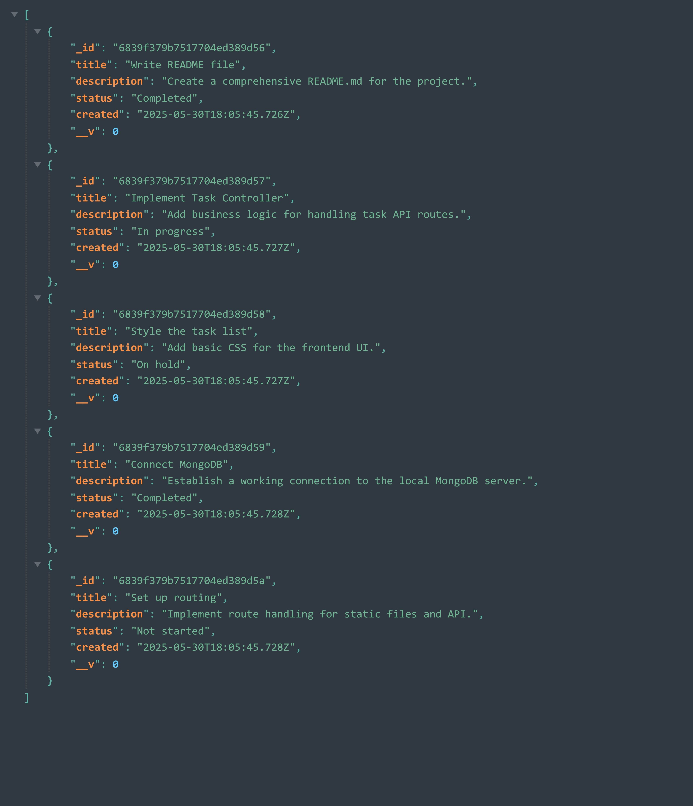
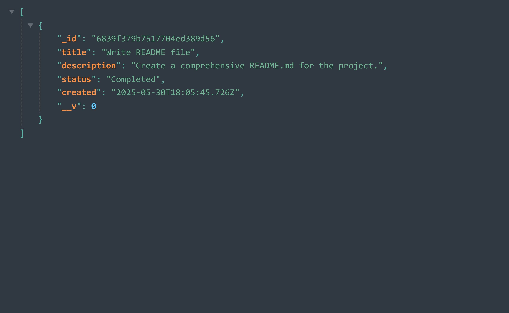

# 🗂️ Mongoose Task Manager

A simple task management backend built with **Node.js**, **MongoDB**, and **Mongoose** — without using any frameworks like Express. It includes a basic HTML renderer and static file server.

---

## 📁 Project Structure

```
mongoose_tasks/
│
├── controllers/
│   └── TasksController.js        # Task controller for business logic
│
├── models/
│   └── task.model.js             # Mongoose schema and DB operations
│
├── static/
│   ├── index.html                # Main HTML template
│   ├── style.css                 # Page styling
│   └── app.js                    # Optional frontend logic
│
├── util/
│   ├── htmlRenderer.js           # Template engine for HTML rendering
│   └── serverHelper.js           # Static file server, JSON/POST helpers
│
├── routes.js                     # HTTP routes and API endpoints
├── server.js                     # Node.js HTTP server entry point
├── package.json
└── package-lock.json
```

---

## 🚀 Getting Started

### ✅ Requirements

- Node.js (v16+ recommended)
- MongoDB running locally on `mongodb://127.0.0.1:27017`

### 📦 Installation

1. Clone the repository:

```bash
git clone https://github.com/Jaroslaw-Baumgart/mongoose_tasks
cd mongoose_tasks
```

2. Install dependencies:

```bash
npm install
```

3. Start your MongoDB server:

```bash
mongod
```

4. Run the project:

```bash
node server.js
```

5. Open your browser:

```
http://localhost:8080
```

---

## 📡 API Endpoints

| Method | Endpoint             | Description                         |
|--------|----------------------|-------------------------------------|
| GET    | `/`                  | Renders the task list HTML page     |
| GET    | `/api/tasks`         | Returns all tasks in JSON format    |
| GET    | `/api/task/:id`      | Returns task with specific ID       |

---

## 🧠 Task Schema (MongoDB)

Each task document includes:

```js
{
  _id: ObjectId,
  title: String,
  description: String,
  status: String,
  created: Date
}
```

## ✅ Task Status Options

Each task has a `status` field which can be one of the following:

- `Not started` – The task has not been started yet.
- `In progress` – The task is currently being worked on.
- `On hold` – The task is paused or waiting on something.
- `Completed` – The task is finished.

## 📸 Screenshots





---

## 📌 Features

- 🧩 Mongoose-based task model with validation
- 🛠 CRUD operations via `TasksController`
- 📜 HTML rendering using simple template placeholders
- 📂 Static file handling (HTML/CSS/JS)
- 🌐 Basic REST API endpoints for tasks

---

## 🧱 Possible Improvements

- Add POST/PUT/DELETE endpoints for full CRUD
- Improve frontend with forms and JS interactivity
- Add error handling and logging
- Add input validation on the frontend

## 👨‍💻 Author

Created by **Jarosław Baumgart**.

## 📜 License

This project is available under the **MIT License**.

## 📬 Contact

If you have any questions, feel free to reach out:

🔗 **GitHub:** [Jaroslaw-Baumgart](https://github.com/Jaroslaw-Baumgart)  
📧 **Email:** jaroslawbaumgart@gmail.com
